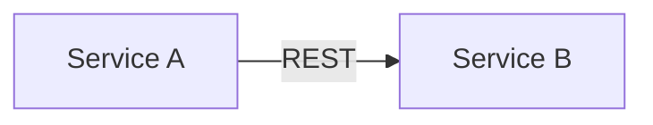

# Rolling Weft

> **Status: early alpha.** Core concepts are stable, but file structure and
> hook behavior may change between versions. Feedback welcome.

Persistent project memory and structured development workflow for
[Claude Code](https://docs.anthropic.com/en/docs/claude-code).

Rolling Weft gives the agent a **development process**: research before code,
record every probe result, capture gotchas as they happen, compound knowledge
before context compression. Task state lives in git via
[beads](https://github.com/steveyegge/beads) and survives session restarts,
context compaction, and agent crashes.

Not a plugin (yet). Just files you copy into your project with a setup script.

---

## Is this for you?

You're integrating with systems that have poor APIs and worse documentation.
You can't just read the docs and implement — you have to *discover* how things
actually behave, one probe at a time. You need an ungodly number of iterations
to get one feature done: prototype, hit an undocumented quirk, record what you
found, adjust, repeat.

Architecture decisions happen in parallel with implementation. Multiple modules
are developed separately but must stay consistent with each other.

If this sounds like your work, Rolling Weft gives your Claude Code agent the
same iterative research discipline you already practice — and makes sure nothing
discovered is lost between sessions or context compactions.

If your projects are straightforward (good docs, linear implementation, single
module) — you probably don't need this.

---

## Why

Claude Code is a capable agent, but it forgets. Context compaction erases nuance.
New sessions start blind. Gotchas discovered on Monday are rediscovered on Thursday.

Rolling Weft solves this by putting project knowledge into **project files** — not
auto-memory, not ephemeral context. Everything is VCS-tracked and shared with the team.

| Problem                          | How Rolling Weft addresses it                                                   |
| -------------------------------- | ------------------------------------------------------------------------------- |
| Agent forgets between sessions   | `bd prime` injects task state at session start                                  |
| Gotchas lost after compaction    | `patterns.md` — durable, VCS-tracked, always available                          |
| Agent makes assumptions silently | ASSUMPTION records reviewed on task close                                       |
| Research is repeated             | FINDING/LEARNED records in beads — next iteration starts where the last stopped |
| Architecture drifts from intent  | `.designs/` with YAML contracts and Mermaid diagrams                            |
| Agent behavior depends on mood   | `CLAUDE.md` encodes **how** the agent works, not what the project does          |

---

## Concepts

### Node Lifecycle

Every task (called a *node* or *bead*) follows a lifecycle:

```
plan → [discover] → investigate → [discuss → approve → probe → record]* → finalize
                                   ────────────────────────────────────
                                                retry loop
```

**Plan** — what are we solving? Check existing knowledge first.

**Discover** (optional) — if the task description is ambiguous, the agent
asks clarifying questions about *what* the task is (not how to implement it).
User can skip if the task is already clear. Answers are recorded as SCOPE in beads.

**Investigate** — read-only. Gather information before writing code.
Check beads for existing FINDINGs, read patterns.md, consult `.designs/`.
If Discover produced a SCOPE, use it to focus the search.

**Retry loop** — the core:
- **Discuss** — what approach do we try? Account for previous FINDINGs.
- **Approve** — decision made, proceed.
- **Probe** — isolated trial: prototype, API call, test run.
- **Record** — `bd comment {ID} "FINDING [tag]: exact observation"`.
  Every probe leaves a trace. Next iteration sees all previous results.

**Finalize** — review assumptions, write LEARNEDs, update design-docs, close.

Three hard rules (enforced by hooks):
1. Every probe must leave a FINDING
2. Before closing: review all ASSUMPTION records
3. Before closing: verify blocking status with user

### Knowledge Routing

Every piece of knowledge has one destination:

| What                       | Where                    | Format                    |
| -------------------------- | ------------------------ | ------------------------- |
| Probe result (exact data)  | beads comment            | `FINDING [tag]: ...`      |
| Gotcha for future sessions | beads + patterns.md      | `LEARNED [tag]: ...`      |
| Unverified decision        | beads comment            | `ASSUMPTION [tag]: ...`   |
| Task state, next steps     | beads                    | `bd update`, `bd close`   |
| Module contract            | `.designs/{module}.md`   | YAML code block           |
| Cross-module invariant     | `.designs/invariants.md` | Numbered rules            |
| Architectural gate         | `constitution.md`        | Rule + violation protocol |

### Comment Convention

Beads comments use **prefixes** (what kind) and **tags** (what domain):

```
bd comment BD-042 "FINDING [com, vendorx]: GetProducts returns Object[], not Product[]"
bd comment BD-042 "LEARNED [sql]: code 810 for RUB, not 643 (ISO 4217)"
bd comment BD-042 "ASSUMPTION [dotnet]: using int for PK"
```

Tags are stack/domain level: `[com]`, `[sql]`, `[dotnet]`, `[rust]`, `[kafka]`,
`[rest]`, `[grpc]`, `[vendorx]`. No semantic tags like `[currency-conversion]` —
keep the taxonomy bounded.

---

## Installation

**Requirements:** Node.js (any modern version). No WSL, no bash required.

Clone this repository once. Then run setup for each project you want to add it to.

### Windows

```bat
src\setup\install.bat C:\projects\my-app
```

### Linux / macOS

```bash
npm install -g @beads/bd
node /path/to/rolling-weft/src/setup/setup.js /path/to/my-app
```

The installer:
1. Copies templates (CLAUDE.md, constitution.md, patterns.md, design-doc scaffolds) —
   only if the target file doesn't exist
2. Copies skills and hooks — always overwrites (keeps framework up to date on re-run)
3. Runs `bd init` to initialize beads — skips if `.beads/` already exists
4. Configures Claude Code hooks in `.claude/settings.json`

Re-running is safe — user-edited files (CLAUDE.md, constitution.md, patterns.md)
are never overwritten.

### After Setup: Customize

**CLAUDE.md** — fill in the `## Project Context` section at the bottom:

```markdown
## Project Context

**Domain:** Payment processing integration with VendorX one
**Platform:** .NET Framework 4.8.1, Windows, COM Interop
**Key constraint:** COM API is STA-only — serialize all calls
**External systems:** VendorX one (COM), Backend (gRPC), Kafka
**Reference:** `.context/patterns.md` for known gotchas
**Constitution:** `constitution.md` for architectural gates
```

**constitution.md** — replace placeholder sections with your actual constraints.
Delete sections that don't apply. Add domain-specific ones.

**.designs/index.md** — draw your system's module graph. Even a simple one helps:



### Commit

```bash
cd my-app
git add CLAUDE.md constitution.md .context/ .designs/ .claude/ hooks/ .beads/
git commit -m "Add Rolling Weft"
```

---

## What You Get

After setup, your project has:

```
CLAUDE.md                    ← behavioral rules for the agent (always loaded)
constitution.md              ← architectural gates (checked before decisions)

.claude/
├── settings.json            ← Claude Code hooks configuration
└── skills/
    ├── node-lifecycle/
    │   └── SKILL.md         ← core: task phases, hard rules, recovery patterns
    ├── investigation/
    │   └── SKILL.md         ← research-first, sub-agent delegation
    ├── compound/
    │   └── SKILL.md         ← knowledge extraction before /compact
    ├── design-docs/
    │   └── SKILL.md         ← design document management
    ├── constitution/
    │   └── SKILL.md         ← guided constitution.md setup and revision
    └── onboarding/
        └── SKILL.md         ← project inception session (run once at start)

.context/
└── patterns.md              ← project knowledge: gotchas, workarounds, patterns

.designs/
├── index.md                 ← system overview + module graph (Mermaid)
├── _template.md             ← copy this for new module slices
└── invariants.md            ← cross-module rules (when you have them)

.beads/                      ← task tracker state (managed by bd)

hooks/
└── scripts/
    ├── session-start.js     ← bd prime + patterns.md reminder
    ├── pre-commit.js        ← remind to update beads before git commit
    ├── pre-compact.js       ← remind to compound before /compact
    ├── knowledge-capture.js ← LEARNED → knowledge.jsonl index
    ├── finalize-check.js    ← review assumptions before bd close
    └── record-enforcement.js← remind to record FINDING after probe
```

---

## Using Beads

[Beads](https://github.com/steveyegge/beads) is a git-backed CLI issue tracker.
Rolling Weft uses it for task state, findings, and knowledge.

```bash
bd ready              # What can I work on now? (respects dependencies)
bd prime              # Inject current task context (~1-2K tokens)
bd create "Fix X"     # Create a task
bd update BD-001 --claim              # Claim task (assign + set in_progress)
bd update BD-001 --notes "Stopping: investigated A, need to try B next"
bd comment BD-001 "FINDING [com]: GetProducts returns Object[] not Product[]"
bd comment BD-001 "LEARNED [com]: batch limit 100, undocumented"
bd close BD-001       # Mark complete
```

The session-start hook runs `bd prime` automatically. The next session
starts knowing exactly what was in progress and what was found.

### Single-Repo Setup

For a single project — nothing extra needed. `setup.js` creates everything.
One `.beads/`, one `patterns.md`, one `.designs/`. This covers most projects.

### Multi-Repo Setup

For projects with independently developed modules (e.g., a .NET module
on Windows, a Rust backend on Linux) that share contracts:

**Run `setup.js` in each repo independently.** Each module gets its own
CLAUDE.md, constitution.md, patterns.md, `.beads/`, and `.designs/`.
Beads stays per-module — no cross-repo beads coordination needed.

The differences grow organically: one module's constitution says
".NET Framework 4.8, COM Interop, STA threading"; another says
"Rust, Linux, async runtime."

#### Sharing Contracts via Submodule (optional)

If modules share interfaces (gRPC, Kafka schemas, etc.), create a
**shared-contracts** repo and add it as a git submodule:

```bash
# Create the shared-contracts repo
mkdir shared-contracts && cd shared-contracts && git init
mkdir -p .designs protos
# Add system overview, contracts, invariants
git add . && git commit -m "Initial shared contracts"
git remote add origin <url> && git push

# Add as submodule in each module repo
cd ~/one-module
git submodule add <url> shared
cd ~/backend
git submodule add <url> shared
```

Structure:
```
shared-contracts/          ← git repo, submodule in each module
├── .designs/
│   ├── index.md           ← system overview (Mermaid graph)
│   ├── grpc-contracts.md  ← agreed contracts (YAML)
│   └── invariants.md      ← cross-module rules
└── protos/                ← shared proto definitions (if any)
```

When a developer discovers a breaking change:

```bash
# Update the contract in the submodule
cd shared/
# edit .designs/grpc-contracts.md
git add . && git commit -m "PaymentRequest: amount int → decimal(18,4)"
git push
cd ..
git add shared && git commit -m "shared: PaymentRequest contract change"
```

Other developers get the change on `git submodule update --remote shared/`.
The **session-start hook** detects changes in `shared/` automatically and
alerts the agent:

```
shared-contracts changed since last session:
  shared/.designs/grpc-contracts.md
Check if these changes affect your module's .designs/ or code.
```

**No shared-contracts repo?** Each module keeps its own `.designs/` with its
own view of the world. Coordination happens through human communication.
This is fine for small teams.

---

## Skills

Skills are loaded on demand when the situation matches. They stay out of
context until needed (~2-4KB each vs. loading everything into every session).

| Situation                     | Skill                    | When                               |
| ----------------------------- | ------------------------ | ---------------------------------- |
| Working on a tracked task     | `@skills/node-lifecycle` | Plan, investigate, probe, finalize |
| Unfamiliar API or vendor docs | `@skills/investigation`  | Before writing code                |
| About to run `/compact`       | `@skills/compound`       | Before context compression         |
| Creating/updating design docs | `@skills/design-docs`    | Contract changes                   |
| Setting up or revising gates  | `@skills/constitution`   | New project, new constraint found  |
| Project inception session     | `@skills/onboarding`     | Once, at project start             |

Skills are referenced in CLAUDE.md via a table. Claude reads them via the
`@skills/name` syntax or directly when the situation matches.

---

## Hooks

Six Node.js hooks run automatically at the right moments. All are pure Node.js
(no bash, no WSL) — work identically on Windows and Linux.

| Hook               | When                           | What                                |
| ------------------ | ------------------------------ | ----------------------------------- |
| session-start      | Session begins                 | `bd prime` + patterns.md reminder   |
| pre-commit         | Before `git commit`            | Reminds to update beads state       |
| pre-compact        | Before `/compact`              | Reminds to run compound procedure   |
| knowledge-capture  | After `bd comment ... LEARNED` | Indexes to `knowledge.jsonl`        |
| finalize-check     | Before `bd close`              | Assumption review + blocking status |
| record-enforcement | After probe-like commands      | Reminds to record FINDING           |

Hooks degrade gracefully: if `bd` is not installed, session-start skips `bd prime`
and shows a warning instead of failing.

---

## Design Principles

**Research before code.** For unfamiliar APIs: investigate first, document findings,
get confirmation, then implement. Constitution gates prevent architectural drift.

**Compound, don't compact.** Extract knowledge before compressing context. A new session
with loaded project files has full continuity without the token overhead of a full context.

**Record everything.** Every probe leaves a FINDING. Every gotcha becomes a LEARNED.
Every unverified decision is an ASSUMPTION. On finalize, assumptions are reviewed.
Knowledge loss is the biggest cost in iterative development.

**Project knowledge in project files.** Auto-memory (`~/.claude/projects/`) is
for personal preferences. Everything project-specific goes in VCS-tracked files —
shared with the whole team.

**Reliability over intelligence.** Files always loaded (CLAUDE.md) are more reliable
than tools that must be invoked. Skills load when referenced. Hooks run automatically.
Don't depend on the agent remembering to do something.

**Delegate heavy analysis.** Large log files, vendor docs, codebase-wide searches —
delegate to a sub-agent with a clean context window. Only the summary enters
the main context.

---

## Key Constraints

- **No build step.** What's in `src/` is what users get.
- **Windows-compatible.** All hooks and scripts are pure Node.js.
- **One external dependency: beads.** Hooks degrade gracefully if it's missing.
- **Idempotent setup.** Re-running `setup.js` on an existing project is always safe.

---

## License

MIT. See [LICENSE](./LICENSE).

---

## Acknowledgements

Rolling Weft is a composition, not an invention. These projects shaped it:

- [Continuous Claude v3](https://github.com/parcadei/Continuous-Claude-v3) — compound-before-compact philosophy and lifecycle hooks idea
- [The Claude Protocol](https://github.com/zachshallbetter/the-claude-protocol) — investigation-first discipline, LEARNED records, enforcement through hooks, design-doc contracts
- [Claude Code Orchestrator Kit](https://github.com/maslennikov-ig/claude-code-orchestrator-kit) — CLAUDE.md as behavioral OS, return control pattern
- [beads](https://github.com/steveyegge/beads) — git-backed task tracking
- Rajiv Pant — ["reliability over intelligence" principle](https://rajiv.com/blog/2025/12/12/how-claude-memory-actually-works-and-why-claude-md-matters/)
- [awesome-claude-skills](https://github.com/travisvn/awesome-claude-skills) — skills-as-separate-files pattern
- [Genrich Altshuller](https://en.wikipedia.org/wiki/Genrich_Altshuller) / TRIZ — four concepts used in the onboarding skill: IFR, contradictions, system levels, resources
