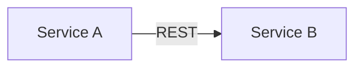

# Rolling Weft

> **Status: beta.** The process works — research before code, probe→record cycle,
> knowledge persistence across sessions. Rough edges remain: the agent doesn't
> always follow the process without reminders. File structure may change between
> versions. Feedback welcome.

Persistent project memory and structured development workflow for
[Claude Code](https://docs.anthropic.com/en/docs/claude-code).
Cross-platform: works on Windows, Linux, and macOS — pure Node.js, no bash or WSL required.

Rolling Weft gives the agent a **development process**: research before code,
record every probe result, capture gotchas as they happen, compound knowledge
before context compression. Task state lives in git via
[beads](https://github.com/steveyegge/beads) and survives session restarts,
context compaction, and agent crashes.

Not a plugin (yet). Just files you copy into your project with a setup script.

---

## Quick Start

**Prerequisites:** [Node.js](https://nodejs.org/), [Claude Code](https://docs.anthropic.com/en/docs/claude-code) CLI, [beads](https://github.com/steveyegge/beads) (`bd` ≥0.63)

```bash
# Clone once, then run setup for each project:
git clone https://github.com/nicubarbaros/rolling-weft.git

# Windows: double-click src\setup\install.bat
# Linux/macOS:
node rolling-weft/src/setup/setup.js /path/to/my-project
```

After setup, start a Claude Code session in your project and run `@skills/onboarding` —
the guided inception session that helps you fill in CLAUDE.md, constitution.md,
and create your first beads task.

See [Installation](#installation) below for detailed steps.

---

## Is this for you?

You're integrating with systems that have poor APIs and worse documentation.
You can't just read the docs and implement — you have to *discover* how things
actually behave, one probe at a time. You need an ungodly number of iterations
to get one feature done: prototype, hit an undocumented quirk, record what you
found, adjust, repeat.

Architecture decisions happen in parallel with implementation. Multiple modules
are developed separately but must stay consistent with each other.

If this sounds like your work, Rolling Weft gives your Claude Code agent the
same iterative research discipline you already practice — and makes sure nothing
discovered is lost between sessions or context compactions.

If your projects are straightforward (good docs, linear implementation, single
module) — you probably don't need this.

---

## Installation

**Requirements:** Node.js, [Claude Code](https://docs.anthropic.com/en/docs/claude-code) CLI, [beads](https://github.com/steveyegge/beads) (`bd` ≥0.63), [Dolt](https://github.com/dolthub/dolt/releases). No WSL, no bash required.

Clone this repository once. Then run setup for each project you want to add it to.

### Windows

Install beads (`bd`) — pick one option:

```powershell
# Option A: via Go (recommended if Go is installed — avoids Defender issues)
go install github.com/steveyegge/beads/cmd/bd@latest

# Option B: via npm
# bd.exe is a Go binary — Windows Defender may quarantine it as a false positive.
# Add an exclusion first:
Add-MpPreference -ExclusionPath "$env:APPDATA\npm"
npm install -g @beads/bd
```

Then run setup for your project:

Double-click `src\setup\install.bat` — it will ask for the project path:

```
Rolling Weft setup

Where should Rolling Weft be installed?
Example: C:\projects\my-app

Project path: C:\projects\my-app
```

Or pass the path directly (useful for scripting):

```bat
src\setup\install.bat C:\projects\my-app
```

### Linux / macOS

Install beads (`bd`):

```bash
npm install -g @beads/bd
# or: go install github.com/steveyegge/beads/cmd/bd@latest
```

Then run setup for your project:

```bash
node /path/to/rolling-weft/src/setup/setup.js /path/to/my-app
```

The installer:
1. Copies templates (CLAUDE.md, constitution.md, patterns.md, design-doc scaffolds) —
   only if the target file doesn't exist
2. Copies skills and hooks — always overwrites (keeps framework up to date on re-run)
3. Runs `bd init --mode server` to initialize beads — skips if `.beads/` already exists
4. Configures Claude Code hooks in `.claude/settings.json`
5. Installs plugins — clones [WH-2099/mermaid-skill](https://github.com/WH-2099/mermaid-skill)
   as Mermaid syntax reference, installs `feature-dev` and `pr-review-toolkit` from marketplace

Re-running is safe — user-edited files (CLAUDE.md, constitution.md, patterns.md)
are never overwritten.

### After Setup: Customize

**CLAUDE.md** — fill in the `## Project Context` section at the bottom:

```markdown
## Project Context

**Domain:** Payment processing integration with VendorX one
**Platform:** .NET Framework 4.8.1, Windows, COM Interop
**Key constraint:** COM API is STA-only — serialize all calls
**External systems:** VendorX one (COM), Backend (gRPC), Kafka
**Reference:** `.context/patterns.md` for known gotchas
**Constitution:** `constitution.md` for architectural gates
```

**constitution.md** — replace placeholder sections with your actual constraints.
Delete sections that don't apply. Add domain-specific ones.

**.designs/index.md** — draw your system's module graph. Even a simple one helps:


```mermaid
graph LR
  A[Service A] -->|REST| B[Service B]
```

### Commit

```bash
cd my-app
git add CLAUDE.md constitution.md .context/ .designs/ .claude/ .hooks/ .beads/
git commit -m "Add Rolling Weft"
```

---

## Why

Claude Code is a capable agent, but it forgets. Context compaction erases nuance.
New sessions start blind. Gotchas discovered on Monday are rediscovered on Thursday.

Rolling Weft solves this by putting project knowledge into **project files** — not
auto-memory, not ephemeral context. Everything is VCS-tracked and shared with the team.

| Problem                          | How Rolling Weft addresses it                                                   |
| -------------------------------- | ------------------------------------------------------------------------------- |
| Agent forgets between sessions   | `bd prime` injects task state at session start                                  |
| Gotchas lost after compaction    | `patterns.md` — durable, VCS-tracked, always available                          |
| Agent makes assumptions silently | ASSUMPTION records reviewed on task close                                       |
| Research is repeated             | FINDING/LEARNED records in beads — next iteration starts where the last stopped |
| Architecture drifts from intent  | `.designs/` with YAML contracts and Mermaid diagrams                            |
| Agent behavior depends on mood   | `CLAUDE.md` encodes **how** the agent works, not what the project does          |

---

## Concepts

### Node Lifecycle

Every task (called a *node* or *bead*) follows a lifecycle. The lifecycle
**always owns the bead** — feature-dev, probes, and other tools operate
inside the work phase.

```
context load → business logic audit → scope decision → [work → verify → assess → record]* → finalize
                                                        ─────────────────────────────────
                                                                  iteration cycle
```

**Context Load** (mandatory) — load full context before any work: `bd show {ID}`,
check `.designs/`, `constitution.md`, `.context/patterns/`, related beads.

**Business Logic Audit** (mandatory) — agent presents a synthesis: what should
this bead accomplish in business terms? Open questions? Assumptions?
User confirms or corrects. Recorded as SCOPE. Happens every time, even if
the bead has rich context — understanding drifts.

**Scope Decision** — classify the work: feature, probe, fix, or research.
Determines which tool handles the work phase.

**Iteration Cycle** — all work types follow the same model. The tool changes,
the cycle doesn't:
- **Feature** → feature-dev (phases 2-7, summary = handoff) → review gate
  (code-reviewer + silent-failure-hunter) → assess → record
- **Probe** → discuss → approve → probe → record
- **Fix** → investigate → implement → verify → record
- **Research** → investigation skill → present findings

**Finalize** (lightweight) — FINDINGs complete? ASSUMPTIONs reviewed?
Blocking status verified? Close. Patterns.md updates happen during compound,
not here.

Six hard rules (enforced by hooks):
1. Every iteration must leave a FINDING
2. Before closing: review all ASSUMPTION records
3. Before closing: verify blocking status with user
4. One bead, one scope — new work spawns a new bead
5. Claim before work, unclaim before switch (`bd update {ID} --claim` / `--status open --assignee ""`)
6. Lifecycle owns the bead, tools own the work — feature-dev, probes, investigation are called *within* the lifecycle

### Knowledge Routing

Every piece of knowledge has one destination:

| What                            | Where                    | Format                    |
| ------------------------------- | ------------------------ | ------------------------- |
| Business logic synthesis        | beads                    | `SCOPE: ...`              |
| Work type classification        | beads                    | `SCOPE-DECISION: ...`     |
| Iteration result (exact data)   | beads                    | `FINDING [tag]: ...`      |
| Gotcha for future sessions      | beads + patterns/        | `LEARNED [tag]: ...`      |
| Unverified decision             | beads                    | `ASSUMPTION [tag]: ...`   |
| Task state, next steps          | beads                    | `bd update`, `bd close`   |
| Module contract                 | `.designs/{module}.md`   | YAML code block           |
| Cross-module invariant          | `.designs/invariants.md` | Numbered rules            |
| Architectural gate              | `constitution.md`        | Rule + violation protocol |

### Comment Convention

Beads comments use **prefixes** (what kind) and **tags** (what domain):

```
bd comments add BD-042 "SCOPE: process payments via COM API, batch mode, retry on timeout"
bd comments add BD-042 "SCOPE-DECISION: feature — implementing batch payment processor"
bd comments add BD-042 "FINDING [com, vendorx]: GetProducts returns Object[], not Product[]"
bd comments add BD-042 "LEARNED [sql]: code 810 for RUB, not 643 (ISO 4217)"
bd comments add BD-042 "ASSUMPTION [dotnet]: using int for PK"
```

Tags are stack/domain level: `[com]`, `[sql]`, `[dotnet]`, `[rust]`, `[kafka]`,
`[rest]`, `[grpc]`, `[vendorx]`. No semantic tags like `[currency-conversion]` —
keep the taxonomy bounded.

---

## What You Get

After setup, your project has:

```
CLAUDE.md                    ← behavioral rules for the agent (always loaded)
constitution.md              ← architectural gates (checked before decisions)

.claude/
├── settings.json            ← Claude Code hooks configuration
└── skills/
    ├── node-lifecycle/
    │   └── SKILL.md         ← core: bead lifecycle, context load, business audit, iteration cycle
    ├── investigation/
    │   └── SKILL.md         ← research-first, sub-agent delegation
    ├── compound/
    │   └── SKILL.md         ← heavy knowledge extraction at session boundaries
    ├── consolidation/
    │   └── SKILL.md         ← project entropy reduction, meta-audit across beads
    ├── design-docs/
    │   └── SKILL.md         ← format, vertical slicing, diagrams, iterative lifecycle
    ├── mermaid-diagram/     ← Mermaid syntax reference (cloned from WH-2099/mermaid-skill)
    ├── constitution/
    │   └── SKILL.md         ← guided constitution.md setup and revision
    └── onboarding/
        └── SKILL.md         ← project inception session (run once at start)

.context/
└── patterns.md              ← project knowledge: gotchas, workarounds, patterns

.designs/
├── index.md                 ← system overview + module graph (Mermaid)
├── _template.md             ← copy this for new module slices
└── invariants.md            ← cross-module rules (when you have them)

.beads/                      ← task tracker state (managed by bd)

.hooks/
└── scripts/
    ├── session-start.js     ← bd prime + patterns.md reminder
    ├── pre-commit.js        ← remind to update beads before git commit
    ├── pre-compact.js       ← remind to compound before /compact
    ├── knowledge-capture.js ← LEARNED → knowledge.jsonl + learned:{tag} labels
    ├── finalize-check.js    ← review assumptions before bd close
    └── record-enforcement.js← remind to record FINDING after probe
```

---

## Using Beads

[Beads](https://github.com/steveyegge/beads) is a Dolt-backed CLI issue tracker.
Rolling Weft uses it for task state, findings, and knowledge.

```bash
bd ready              # What can I work on now? (respects dependencies)
bd prime              # Inject current task context (~1-2K tokens)
bd create "Fix X"     # Create a task
bd update BD-001 --claim              # Claim task (assign + set in_progress)
bd update BD-001 --notes "Stopping: investigated A, need to try B next"
bd comments add BD-001 "FINDING [com]: GetProducts returns Object[] not Product[]"
bd comments add BD-001 "LEARNED [com]: batch limit 100, undocumented"
bd close BD-001       # Mark complete
```

The session-start hook runs `bd prime` automatically. The next session
starts knowing exactly what was in progress and what was found.

### Single-Repo Setup

For a single project — nothing extra needed. `setup.js` creates everything.
One `.beads/`, one `patterns.md`, one `.designs/`. This covers most projects.

### Multi-Repo Setup

For projects with independently developed modules (e.g., a .NET module
on Windows, a Rust backend on Linux) that share contracts:

**Run `setup.js` in each repo independently.** Each module gets its own
CLAUDE.md, constitution.md, patterns.md, `.beads/`, and `.designs/`.
Beads stays per-module — no cross-repo beads coordination needed.

The differences grow organically: one module's constitution says
".NET Framework 4.8, COM Interop, STA threading"; another says
"Rust, Linux, async runtime."

#### Sharing Contracts via Submodule (optional)

If modules share interfaces (gRPC, Kafka schemas, etc.), create a
**shared-contracts** repo and add it as a git submodule:

```bash
# Create the shared-contracts repo
mkdir shared-contracts && cd shared-contracts && git init
mkdir -p .designs protos
# Add system overview, contracts, invariants
git add . && git commit -m "Initial shared contracts"
git remote add origin <url> && git push

# Add as submodule in each module repo
cd ~/one-module
git submodule add <url> shared
cd ~/backend
git submodule add <url> shared
```

Structure:
```
shared-contracts/          ← git repo, submodule in each module
├── .designs/
│   ├── index.md           ← system overview (Mermaid graph)
│   ├── grpc-contracts.md  ← agreed contracts (YAML)
│   └── invariants.md      ← cross-module rules
└── protos/                ← shared proto definitions (if any)
```

When a developer discovers a breaking change:

```bash
# Update the contract in the submodule
cd shared/
# edit .designs/grpc-contracts.md
git add . && git commit -m "PaymentRequest: amount int → decimal(18,4)"
git push
cd ..
git add shared && git commit -m "shared: PaymentRequest contract change"
```

Other developers get the change on `git submodule update --remote shared/`.
The **session-start hook** detects changes in `shared/` automatically and
alerts the agent:

```
shared-contracts changed since last session:
  shared/.designs/grpc-contracts.md
Check if these changes affect your module's .designs/ or code.
```

**No shared-contracts repo?** Each module keeps its own `.designs/` with its
own view of the world. Coordination happens through human communication.
This is fine for small teams.

---

## Skills

Skills are loaded on demand when the situation matches. They stay out of
context until needed (~2-4KB each vs. loading everything into every session).

| Situation                     | Skill                      | When                                        |
| ----------------------------- | -------------------------- | ------------------------------------------- |
| Working on a tracked task     | `@skills/node-lifecycle`   | Context load, audit, iterate, finalize      |
| Unfamiliar API or vendor docs | `@skills/investigation`    | Before writing code                         |
| Session ending or milestone   | `@skills/compound`         | Heavy knowledge extraction                  |
| After a wave of features      | `@skills/consolidation`    | Audit beads, designs, code patterns, naming |
| Creating/updating design docs | `@skills/design-docs`      | Contract changes, diagram design            |
| Setting up or revising gates  | `@skills/constitution`     | New project, new constraint found           |
| Project inception session     | `@skills/onboarding`       | Once, at project start                      |

**External plugins** (installed by setup):

| Plugin | Source | Role |
| ------ | ------ | ---- |
| `feature-dev` | Marketplace | Guided feature implementation (phases 2-7 inside the iteration cycle) |
| `pr-review-toolkit` | Marketplace | Review gate: code-reviewer + silent-failure-hunter after feature-dev |
| `mermaid-skill` | [WH-2099/mermaid-skill](https://github.com/WH-2099/mermaid-skill) | Up-to-date Mermaid syntax reference (auto-synced from official docs) |

Skills are referenced in CLAUDE.md via a table. Claude reads them via the
`@skills/name` syntax or directly when the situation matches.

---

## Hooks

Six Node.js hooks run automatically at the right moments.
These are [Claude Code hooks](https://docs.anthropic.com/en/docs/claude-code/hooks)
(event-based callbacks configured in `.claude/settings.json`), not Git hooks.
All are pure Node.js — work identically on Windows, Linux, and macOS without bash or WSL.

| Hook               | When                           | What                                     |
| ------------------ | ------------------------------ | ---------------------------------------- |
| session-start      | Session begins                 | `bd prime` + patterns.md reminder        |
| pre-commit         | Before `git commit`            | Reminds to update beads state            |
| pre-compact        | Before `/compact`              | Reminds to run compound procedure        |
| knowledge-capture  | After `bd comments add ... LEARNED` | Indexes to `knowledge.jsonl` + labels bead with `learned:{tag}` |
| finalize-check     | Before `bd close`              | Assumption review + blocking status      |
| record-enforcement | After probe-like commands      | Reminds to record FINDING                |

Hooks degrade gracefully: if `bd` is not installed, session-start skips `bd prime`
and shows a warning instead of failing.

---

## Design Principles

**Audit before code.** Every bead starts with a mandatory business logic audit —
the agent synthesizes what it understands, the user confirms or corrects.
For unfamiliar APIs: investigate first, document findings, get confirmation,
then implement. Constitution gates prevent architectural drift.

**Compound at boundaries, finalize every bead.** Finalize is lightweight — check
FINDINGs, ASSUMPTIONs, blocking status, close. Compound is heavy — extract
knowledge to patterns, update designs, persist state. Compound runs at session
boundaries and epic milestones, not every bead close.

**Record everything.** Every probe leaves a FINDING. Every gotcha becomes a LEARNED.
Every unverified decision is an ASSUMPTION. On finalize, assumptions are reviewed.
Knowledge loss is the biggest cost in iterative development.

**Project knowledge in project files.** Auto-memory (`~/.claude/projects/`) is
for personal preferences. Everything project-specific goes in VCS-tracked files —
shared with the whole team.

**Reliability over intelligence.** Files always loaded (CLAUDE.md) are more reliable
than tools that must be invoked. Skills load when referenced. Hooks run automatically.
Don't depend on the agent remembering to do something.

**Delegate heavy analysis.** Large log files, vendor docs, codebase-wide searches —
delegate to a sub-agent with a clean context window. Only the summary enters
the main context.

---

## Key Constraints

- **No build step.** What's in `src/` is what users get.
- **Cross-platform.** All hooks and scripts are pure Node.js — they work identically on Windows, Linux, and macOS. No bash, no WSL, no platform-specific shell scripts.
- **Core dependency: beads.** Hooks degrade gracefully if it's missing. External plugins (feature-dev, pr-review-toolkit, mermaid-skill) are recommended but optional.
- **Idempotent setup.** Re-running `setup.js` on an existing project is always safe.

---

## Troubleshooting

### Windows Defender blocks bd.exe

`bd` is a Go binary installed via npm. Windows Defender may quarantine it as a false positive.

**Fix:** Add an exclusion before installing:
```powershell
Add-MpPreference -ExclusionPath "$env:APPDATA\npm"
npm install -g @beads/bd
```
Or install via Go instead: `go install github.com/steveyegge/beads/cmd/bd@latest`

### Dolt

Rolling Weft uses **server mode** (`bd init --mode server`) because embedded Dolt
requires a C compiler (CGO) on Windows. This means you need the `dolt` binary installed
separately — see [Dolt releases](https://github.com/dolthub/dolt/releases).

For multi-writer support (multiple agents writing simultaneously),
run a separate `dolt sql-server`:

```powershell
dolt sql-server --port 3307
```

### bd not found

Make sure `bd` is on your PATH:
```bash
bd --version
```
If installed via npm: check that `npm bin -g` is in your PATH.
If installed via Go: check that `$GOPATH/bin` (or `$HOME/go/bin`) is in your PATH.

### Hooks not firing

Hooks are registered in `.claude/settings.json`. If they're not running:
1. Check that `.claude/settings.json` exists and contains hook entries
2. Re-run `setup.js` — it regenerates hook configuration on every run
3. Make sure hooks scripts exist at `.hooks/scripts/` in your project root

---

## License

MIT. See [LICENSE](./LICENSE).

---

## Acknowledgements

Rolling Weft is a composition, not an invention. These projects shaped it:

- [Continuous Claude v3](https://github.com/parcadei/Continuous-Claude-v3) — compound-before-compact philosophy and lifecycle hooks idea
- [The Claude Protocol](https://github.com/zachshallbetter/the-claude-protocol) — investigation-first discipline, LEARNED records, enforcement through hooks, design-doc contracts
- [Claude Code Orchestrator Kit](https://github.com/maslennikov-ig/claude-code-orchestrator-kit) — CLAUDE.md as behavioral OS, return control pattern
- [beads](https://github.com/steveyegge/beads) — git-backed task tracking
- Rajiv Pant — ["reliability over intelligence" principle](https://rajiv.com/blog/2025/12/12/how-claude-memory-actually-works-and-why-claude-md-matters/)
- [awesome-claude-skills](https://github.com/travisvn/awesome-claude-skills) — skills-as-separate-files pattern
- [WH-2099/mermaid-skill](https://github.com/WH-2099/mermaid-skill) — Mermaid syntax reference (auto-synced from official mermaid-js docs)
- [mgranberry/mermaid-diagram-skill](https://github.com/mgranberry/mermaid-diagram-skill) and [coleam00/excalidraw-diagram-skill](https://github.com/coleam00/excalidraw-diagram-skill) — Mermaid practical rules distilled from their syntax pitfalls, theming, and layout guidelines
- [Genrich Altshuller](https://en.wikipedia.org/wiki/Genrich_Altshuller) / TRIZ — four concepts used in the onboarding skill: IFR, contradictions, system levels, resources
