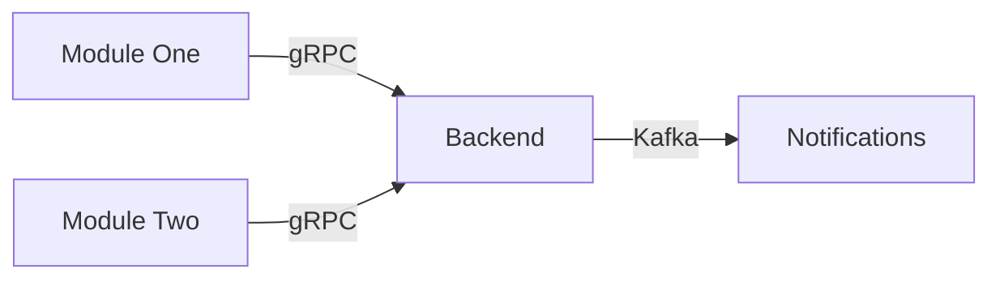
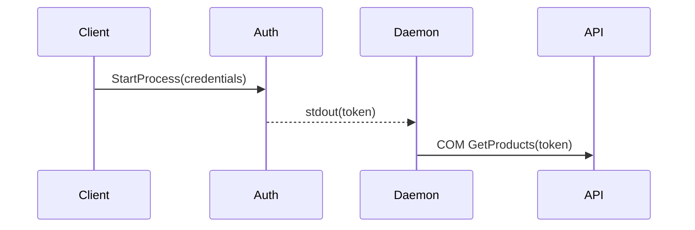

# Design Documents

Design documents live in `.designs/` and describe what modules expose and expect.
They are the source of truth for cross-module contracts.

## Format: Markdown + YAML + Mermaid

- **YAML code blocks** for machine-comparable contracts (field names, types, enums, error codes)
- **Mermaid diagrams** for visual flows (system-level and module-internal)
- **Markdown** for context, constraints, rationale

## Structure

```
.designs/
├── index.md          ← system overview + Mermaid module graph + links to slices
├── {module-a}.md     ← vertical slice: one file per module/boundary
├── {module-b}.md
└── invariants.md     ← cross-module rules (numbered: INV-001, INV-002)
```

### Vertical Slicing Rules

- **One file = one module or system boundary** (not one file per feature)
- **~200 lines per slice** — exceeding this signals need for decomposition
- **Cross-module invariants** in `invariants.md`, never duplicate across slices
- **Type mappings** documented in the consuming module's slice
- **FINDINGs** reference specific slice: `"FINDING: see .designs/com-bridge.md#contract"`

## When to Create

- New module or system boundary
- Cross-module interaction that needs agreed contracts
- Epic that affects multiple modules
- Before breaking changes to shared interfaces

## When to Update

### Minor Change (clarification, fix, new example)
Update the design-doc in the same commit as the code change:
```
bd comment {ID} "FINDING [tag]: updated field X in .designs/{module}.md
  (was: int, now: decimal — precision requirement from probe)"
```

### Breaking Change (new required field, type change, removed endpoint)
Breaking changes require coordination:

1. Update the contract in `shared/.designs/` (if using shared-contracts submodule)
   or in the local `.designs/` with a clear FINDING:
   ```
   bd comment {ID} "FINDING [grpc]: BREAKING — amount changes from int to decimal(18,4).
     Affects: all modules consuming PaymentRequest"
   ```
2. Record LEARNED:
   ```
   bd comment {ID} "LEARNED [grpc]: contract changed, reason: {root cause from FINDING}"
   ```
3. Commit the contract change, push. Other modules will see the change via
   `shared/` submodule update (detected by session-start hook) or manual sync.
4. Notify affected developers — the agent should remind to do this.

## YAML Contract Format

```yaml
service: PaymentGateway
protocol: gRPC
endpoints:
  ProcessPayment:
    request:
      order_id: string (UUID)
      amount: decimal(18,4)
      currency: string (ISO 4217)
    response:
      transaction_id: string (UUID)
      status: enum [success, declined, error]
      error_code: int (nullable)
    errors:
      INVALID_AMOUNT: "amount <= 0 or > 999999.9999"
      CURRENCY_MISMATCH: "currency not in allowed list"
```

Key principles:
- Exact field names and types (not "a number" but "decimal(18,4)")
- Enum values listed explicitly
- Error codes with human-readable descriptions
- Nullable fields marked explicitly

## Mermaid Usage

**System-level** (in index.md): module graph showing connections and protocols.


**Module-level** (inside slices): sequence diagrams for complex internal flows.


Not every slice needs a Mermaid diagram. Use when the flow is non-trivial.

## Drift Awareness

If a FINDING contradicts what's in the design-doc:

1. Note the drift: `"FINDING: field X is decimal(18,4), not int as in .designs/com-bridge.md"`
2. Determine: minor or breaking?
3. Minor → update design-doc + FINDING with commit reference
4. Breaking → update contract in shared/ (or local .designs/), FINDING + LEARNED, notify team

On finalize, check: do any FINDINGs from this work reveal design-doc drift?
