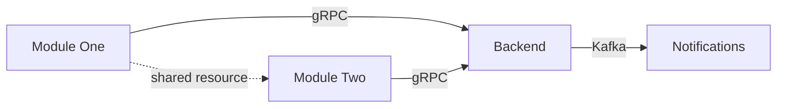

# Design Documents

Design documents live in `.designs/` and describe what modules expose and expect.
They are the source of truth for cross-module contracts.

## Format: Markdown + YAML + Mermaid

- **YAML code blocks** for machine-comparable contracts (field names, types, enums, error codes)
- **Mermaid diagrams** for visual flows (system-level and module-internal)
- **Markdown** for context, constraints, rationale

## Structure

```
.designs/
├── index.md          ← system overview + Mermaid module graph + links to slices
├── {module-a}.md     ← vertical slice: one file per module/boundary
├── {module-b}.md
└── invariants.md     ← cross-module rules (numbered: INV-001, INV-002)
```

### Vertical Slicing Rules

- **One file = one module or system boundary** (not one file per feature)
- **~200 lines per slice** — exceeding this signals need for decomposition
- **Cross-module invariants** in `invariants.md`, never duplicate across slices
- **Type mappings** documented in the consuming module's slice
- **FINDINGs** reference specific slice: `"FINDING: see .designs/com-bridge.md#contract"`

## When to Create

- New module or system boundary
- Cross-module interaction that needs agreed contracts
- Epic that affects multiple modules
- Before breaking changes to shared interfaces

## When to Update

### Minor Change (clarification, fix, new example)
Update the design-doc in the same commit as the code change:
```
bd comments add {ID} "FINDING [tag]: updated field X in .designs/{module}.md
  (was: int, now: decimal — precision requirement from probe)"
```

### Breaking Change (new required field, type change, removed endpoint)
Breaking changes require coordination:

1. Update the contract in `shared/.designs/` (if using shared-contracts submodule)
   or in the local `.designs/` with a clear FINDING:
   ```
   bd comments add {ID} "FINDING [grpc]: BREAKING — amount changes from int to decimal(18,4).
     Affects: all modules consuming PaymentRequest"
   ```
2. Record LEARNED:
   ```
   bd comments add {ID} "LEARNED [grpc]: contract changed, reason: {root cause from FINDING}"
   ```
3. Commit the contract change, push. Other modules will see the change via
   `shared/` submodule update (detected by session-start hook) or manual sync.
4. Notify affected developers — the agent should remind to do this.

## YAML Contract Format

```yaml
service: PaymentGateway
protocol: gRPC
endpoints:
  ProcessPayment:
    request:
      order_id: string (UUID)
      amount: decimal(18,4)
      currency: string (ISO 4217)
    response:
      transaction_id: string (UUID)
      status: enum [success, declined, error]
      error_code: int (nullable)
    errors:
      INVALID_AMOUNT: "amount <= 0 or > 999999.9999"
      CURRENCY_MISMATCH: "currency not in allowed list"
```

Key principles:
- Exact field names and types (not "a number" but "decimal(18,4)")
- Enum values listed explicitly
- Error codes with human-readable descriptions
- Nullable fields marked explicitly

## Diagrams

**Prefer Mermaid and Markdown.** ASCII art only for trivial inline sketches (3-5 boxes).
For anything with relationships, layers, or flow — use Mermaid.

### Goal-First Diagram Design

Before drawing a diagram, answer:

1. **What is this diagram for?** What specific aspect, relationship, or flow does it
   need to communicate? One diagram — one purpose.

2. **What entities belong on this diagram?** Only those relevant to the stated purpose.
   - Don't split an entity into multiple boxes just because it has sub-components —
     unless the purpose is to show those sub-components.
   - Don't merge distinct entities into one box just because they're "similar" —
     unless the purpose is to show them as a group.
   - The purpose determines granularity, not the implementation structure.

3. **What relationships exist?** This is where most diagrams fail.
   - **Direct relationships** (A calls B) are obvious and always shown.
   - **Indirect relationships** (A depends on C through B) are often missing but
     change the reader's understanding of the system.
   - **Constraint relationships** (A must run before B; C and D share a resource)
     are frequently omitted but critical for architecture decisions.
   - **Ownership/lifecycle relationships** (A creates and destroys B) affect
     how you reason about failures and cleanup.
   - Before finalizing: "are there relationships NOT shown that would change
     how someone reads this diagram?" If yes — add them or document why omitted.

4. **What type of diagram fits the purpose?**

   | Purpose | Diagram type |
   |---------|-------------|
   | Module boundaries and dependencies | `graph LR/TD` |
   | Request/response flow, temporal ordering | `sequenceDiagram` |
   | State transitions, lifecycle | `stateDiagram-v2` |
   | Decision logic, branching flows | `flowchart` |
   | Class/interface relationships | `classDiagram` |

### System-Level (in index.md)

Module graph showing connections, protocols, **and non-obvious dependencies**:

```mermaid
graph LR
  One[Module One] -->|"gRPC"| Backend
  Two[Module Two] -->|"gRPC"| Backend
  Backend -->|"Kafka"| Notifications
  One -.->|"shared resource"| Two
```

### Module-Level (inside slices)

Sequence diagrams for complex internal flows. Include indirect participants
if they affect the flow (e.g., shared state, locks, external constraints).

Not every slice needs a diagram. Use when the flow is non-trivial or when
relationships between components are not obvious from the code.

## Drift Awareness

If a FINDING contradicts what's in the design-doc:

1. Note the drift: `"FINDING: field X is decimal(18,4), not int as in .designs/com-bridge.md"`
2. Determine: minor or breaking?
3. Minor → update design-doc + FINDING with commit reference
4. Breaking → update contract in shared/ (or local .designs/), FINDING + LEARNED, notify team

On finalize, check: do any FINDINGs from this work reveal design-doc drift?

## Iterative Lifecycle

Design docs are **living documents**, not write-once artifacts. The observed pattern
is: write before implementation, then iterate as learnings emerge.

### Expected Iteration Pattern

```
write initial design (before code)
  → implement → discover gotcha → update design → continue
  → implement → probe reveals new constraint → update design → continue
  → ...
  → consolidation: review all designs for drift and staleness
```

A design doc that hasn't been updated after 3+ sessions of active work on its
module is likely drifting from reality. Check during compound.

### When a Design Doc Becomes Legacy

Signs:
- The module was significantly rearchitected since the doc was written
- More FINDINGs contradict the doc than support it
- A new design doc covers the same boundary with updated contracts

**Procedure:**
1. Move to `.designs/legacy/` (don't delete — history has value)
2. Create new design doc reflecting current reality
3. Reference the legacy doc: "Replaces: legacy/{old-name}.md. Reason: {why}"

### Design Doc Hygiene (during Consolidation)

During consolidation (`@skills/consolidation`), review all design docs:
- Does each doc still reflect the code?
- Are there modules without design docs that should have them?
- Are there design docs for modules that no longer exist?
- Do YAML contracts match actual field names and types?
